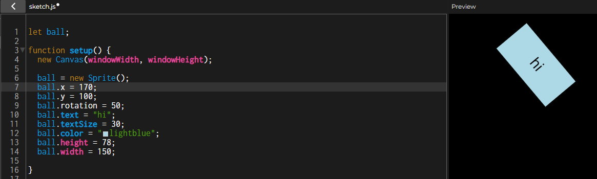

# Tool Learning Log

## Tool: **P5Play**

## Project: **Cat Chance Game**

---

### 10/19/24:
#### Intro to P5Play: Sprites
* P5 is a code library that has a multitude of precoded objects and functions coded in JavaScript that is then used to build our own code, p5play is an addition that adds more to it
* I watched an [Intro to p5play - Sprites](https://youtu.be/ZQ23FHfgA0A?si=oRWzUChn_Sgg8_Po) video to follow along with and understand the concept of p5play better
* When creating sprites there is a shortcut of including the position and size inside of the `Sprite()` parenthesis. Ex: `let block = new Sprite (40, 100, 50, 60)` The values are the x-axis, y-axis, width, and height, respectively 
* Using `windowWidth` and `windowHeight` when creating a new canvas will make it so the canvas fits the size of the window. Ex: `new Canvas(windowWidth, windowHeight);`
    * Can also create an aspect ratio for the canvas instead of setting specific dimensions. Ex: `new Canvas("1:1");`
* I tinkered around with all most of the different attributes to change the shape and appearance of the sprite and discovered that the smaller the y-axis value, the higher the sprite goes.

* Sprites have a default velocity of 0 but can be changed with `.velocity.x = ` or `.velocity.y =`. Positive x value will make the sprite travel to the right and negative value will travel left. A Positive y value will travel down while a negative value will travel up. Activating the velocity for both axis at the same time will have the sprite travel diagonally

* When I was taking notes on Grouping from the p5play website I didn't really understand how it worked, but after watching the video demonstrate it I think I understand it better now, the p5play website and the video use different methods but I think they generally mean the same thing. The video used `for (let i=0; i < 5; i++){let block = new Sprite ()}` while the website used `while (dots.length < 24) {let block = new block.Sprite();` and if it means what I think it means then as long as the amount of current amount of sprites is lower than the specified number, then the loop will keep creating copies of the sprite until the number is met.
* I messed around with the sprite sizes as they collided with each other and noticed that the size of the sprites do affect how they bump into each other like how physics actually works: the smaller the sprite is the less impact it'll cause and vice versa.

### 10/27/2024:
#### Img Sprites and physics
Because the project will require the use of a lot of custom image sprites, I learned about image sprites in p5play
* To set a sprite to an image, it needs to set on a url pathway to the file. e.i. `moustache = new Sprite();
  moustache.img = 'moustache_PNG37.png';`
* My image was way too big when it loaded in so I used `moustache.image.scale = .20` to scale it down to a fifth of its default size, though the website recommends to change the actual size of the img in the file if such issues occur.
* On the p5play website, it uses `sprite.debug = mouse.pressing();` to show the sprite's hitbox when the mouse is clicked, so I used that as well to check my sprite's hitbox. I found that the sprite's hitbox was what would have been the default sprite square. Because of this the hitbox was off centered and too small for the image


* I used the width and height properties to expand the hitbox's size to fit the sprite better and used `.offset` to shift the hitbox's x and y axis to center it on the sprite
* My final code looked like this:
```js
moustache = new Sprite();
moustache.img = 'moustache_PNG37.png';
moustache.image.scale = .20
moustache.image.offset.y = -10;
moustache.image.offset.x = 29;
moustache.w = 430;
moustache.h = 100;
```
This is what the hit box looked after:

* It is important that a sprite's hitbox is accurate to its size to make sure that it interacts with other sprites properly.
  * If the the hitbox is too small, the sprites will overlap, and if the hitbox is too big, the sprites will appear like they did not touch
 
Physics
* Colliders are used to determine collisions between sprites and are set at dynamic by default. Static colliders do not move, kinetic colliders are moved by the program, none collider does not collide with other sprites
* `world.gravity.y;` is used to activate gravity, increasing the y value will increase the speed the sprites will fall.
* I created a floor sprite and gave it a slant using `floor.rotation = 20;` and made its collider static so it wouldn't be affected by gravity and let the other sprite fall on it.
   * Because the sprite's hitbox is retangular it only slid for a little bit before stopping, but when it gave the sprite a round hitbox by setting it's diameter to 40, the sprite rolled along the floor sprite.
My tinker code looks like this:
```js
   let moustache, floor;

          function setup() {
            createCanvas(windowWidth, windowHeight);
            world.gravity.y = 10;

            moustache = new Sprite();
            moustache.img = 'moustache_PNG37.png';
            moustache.image.scale = .20
            moustache.image.offset.y = -10;
            moustache.image.offset.x = 29;
            moustache.x = windowWidth/2
            moustache.y = 100;
            // moustache.w = 430;
            // moustache.h = 100;
            moustache.diameter = 40

            floor = new Sprite();
            floor.w = 1000;
            floor.y = windowHeight-200;
            floor.collider = 's';
            floor.rotation = 20;
          }
```

### 11/11/24
Because my project involves a lot of random generating I wanted to test out what I learned in my project with sprites.
* I took my random number generating code snippet and assigned it to a `rng` variable then I wrote an `if else` function to make it so that if the value was equal to 1, then a sprite would be made. This didn't work.
* I back tracked and made things simpler, taking things step by step to see which part of the code was wrong and which part worked
* I set the `rng` value to 1 and changed the `if` statement to set the sprite's color to blue when the value of 1, this worked.
``` js
   var win
   var rng = 1

      function setup() {
         createCanvas(windowWidth, windowHeight);
         win = new Sprite();
      }

      function draw() {
         background(220);

         if (rng == 1) {
            win.color = 'blue';
         }
      }   
```
* Next I re-added the random value code to generate a number from 0 to 4 and set the `if else` function if set the color to blue if the value was `<=` 1 and the color to red if the value was `>=` 2. This makes the sprite have a 50% chance of being either red or blue
* Since this works I decided to try out the numbers that we will use in the game
``` js
   var win
   var rng = Math.floor(Math.random()*101)

      function setup() {
         createCanvas(windowWidth, windowHeight);
         win = new Sprite();
      }

      function draw() {
         background(220);

         if (rng > 1 && rng < 75) {
                win.color = 'brown';
            } else if (rng > 75 && rng < 95){
                win.color = 'grey';
            } else if (rng > 95) {
                win.color = 'yellow'
            }
      }   
```
* To make sure this works I refreshed the viewing page multiple times until I saw each other several times and the rates that each color popped up matches their respective probabilty.
<!-- 
* Links you used today (websites, videos, etc)
* Things you tried, progress you made, etc
* Challenges, a-ha moments, etc
* Questions you still have
* What you're going to try next
-->
